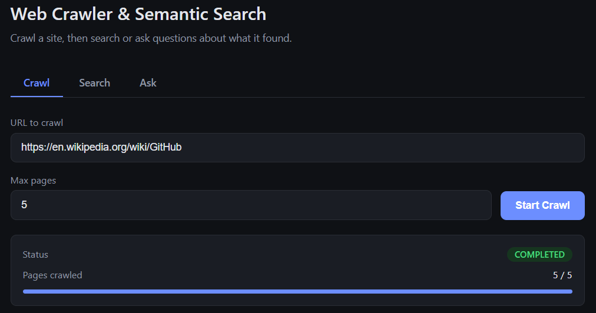
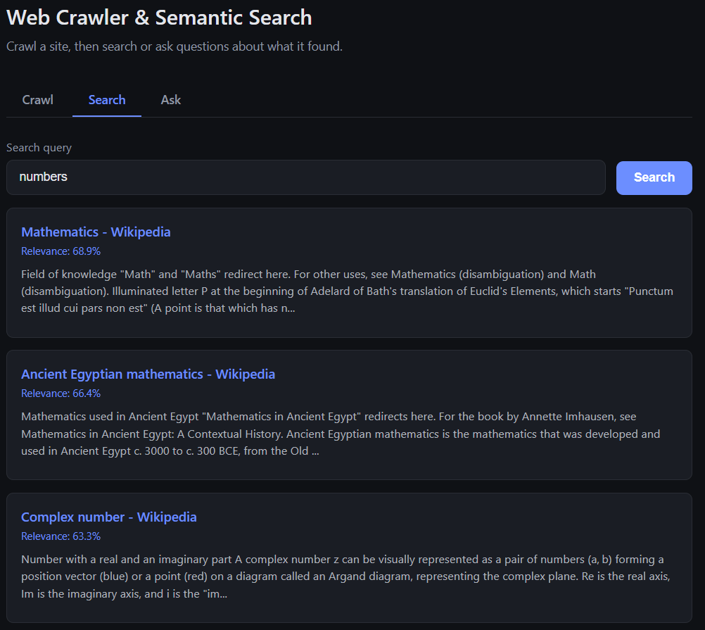
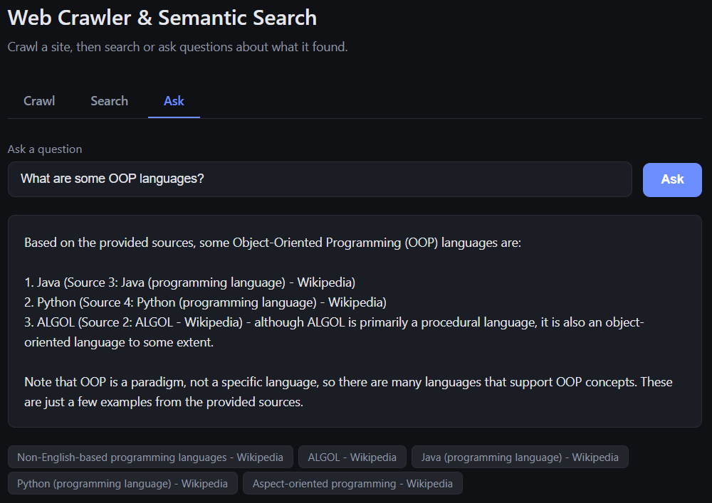

# Distributed Semantic Crawler

A distributed, fault-tolerant web crawler paired with an AI-powered semantic search and question-answering system.

Give it a URL. It crawls the site asynchronously across a pool of independent worker processes, extracts clean article text (stripped of navigation, footers, and boilerplate), generates vector embeddings and AI-written summaries for every page, and indexes everything into Elasticsearch. Once indexed, you can either **search** the content semantically — finding relevant pages even when your query doesn't share exact keywords with them — or **ask** natural-language questions and get a synthesized answer grounded in the crawled content, with cited sources (Retrieval-Augmented Generation).

Everything runs as a set of independently scalable microservices, coordinated entirely through Redis — no service ever talks to another service directly.

---

## Table of contents

- [Why this project exists](#why-this-project-exists)
- [Architecture](#architecture)
- [How a crawl flows through the system](#how-a-crawl-flows-through-the-system)
- [Components](#components)
- [Reliability & correctness](#reliability--correctness)
- [Getting started](#getting-started)
- [Using the application](#using-the-application)
- [Scaling workers](#scaling-workers)
- [API reference](#api-reference)

---

## Why this project exists

Most personal crawler projects are single-threaded scripts that fetch a page, print some text, and stop. This project instead explores what a **production-shaped** version of that idea looks like: multiple independent processes coordinating through message queues, at-least-once delivery guarantees, distributed rate limiting, race-condition-free job completion under concurrency, and a real AI layer on top (embeddings, summarization, RAG) — not just a keyword index.

It was built and hardened incrementally: every architectural decision below (Redis Streams instead of plain lists, atomic slot reservation, coordinated multi-consumer job completion) exists because an earlier, simpler version of it broke under real concurrent load, and was fixed and re-tested until it didn't.

## Architecture

```
                    ┌─────────────┐
   User ──REST/UI──▶│   Master    │
                    │  (REST API) │
                    └──────┬──────┘
                           │ creates job, seeds queue
                           ▼
                    ┌─────────────┐
                    │    Redis    │◀───────────────┐
                    │             │                │
                    │  Streams,   │                │
                    │  job state, │                │
                    │  rate limit │                │
                    └──────┬──────┘                │
                           │                        │
              URL_TO_CRAWL │ stream                 │
                           ▼                        │
                 ┌───────────────────┐               │
                 │  Crawler Worker   │──text──▶      │
                 │  (N instances)    │  TEXT_TO_     │
                 └───────────────────┘  ANALYZE      │
                                          stream      │
                              ┌────────────┴───────────┐
                              ▼                        ▼
                  ┌───────────────────┐    ┌───────────────────┐
                  │ Embedding Worker  │    │  Analyzer Worker   │
                  │  (N instances)    │    │   (N instances)    │
                  │  → HuggingFace    │    │   → HuggingFace    │
                  │    embeddings     │    │     summaries      │
                  └─────────┬─────────┘    └──────────┬─────────┘
                            │                          │
                            └──────────┬───────────────┘
                                       ▼
                              ┌─────────────────┐
                              │  Elasticsearch   │
                              │ (vectors + text  │
                              │   + summaries)   │
                              └─────────────────┘
```

Every worker type is a **separate Spring Boot process**, packaged as its own Docker image, and can be scaled independently to any number of instances. None of them know about each other directly — they only know about Redis.

## How a crawl flows through the system

1. The user submits a URL through the web UI or `POST /crawl`. The **Master** generates a `jobId`, records job metadata in a Redis hash, and pushes the seed URL onto a per-job Redis Stream (`URL_TO_CRAWL:{jobId}`).
2. A **Crawler Worker** picks up the URL via a consumer group, downloads the page, checks `robots.txt`, applies distributed rate limiting, and extracts the main article content (see [Content extraction](#components) below). New same-domain links it discovers are deduplicated and pushed back onto the same stream.
3. The extracted text is pushed onto a second stream, `TEXT_TO_ANALYZE:{jobId}`.
4. Two independent consumer groups read from that second stream in parallel:
   - **Embedding Worker** generates a 384-dimension vector via HuggingFace and indexes the page (URL, title, text, embedding) into Elasticsearch.
   - **Analyzer Worker** generates a short AI summary via HuggingFace and merges it into the same Elasticsearch document.
5. Once the crawl reaches its page limit (or runs out of URLs) *and* both the embedding and analysis streams are fully drained and acknowledged, the job is marked `COMPLETED`.
6. The user can now call `GET /search?q=...` (semantic search over the indexed vectors) or `GET /ask?q=...` (RAG: retrieve the most relevant pages, feed them as context to an LLM, get back a synthesized answer with sources).

## Components

| Service | Responsibility |
|---|---|
| **master-service** | REST API. Creates jobs, exposes job status, semantic search, and the RAG `/ask` endpoint. Serves the built-in web UI. |
| **crawler-worker** | Fetches pages (Jsoup), respects `robots.txt` and `Crawl-delay`, applies distributed rate limiting, deduplicates URLs per job, strips boilerplate to extract main content, persists raw pages to disk, and forwards clean text downstream. |
| **embedding-worker** | Consumes extracted text, calls HuggingFace's `sentence-transformers/all-MiniLM-L6-v2` for embeddings, indexes documents into Elasticsearch with `dense_vector` + cosine similarity. |
| **analyzer-worker** | Consumes the same text stream independently, calls HuggingFace's `facebook/bart-large-cnn` for summarization, and merges the summary into the existing Elasticsearch document via a partial update. |
| **common** | Shared library: Redis Stream helpers, job status service, robots.txt parsing, rate limiter, HuggingFace clients, Elasticsearch client. |
| **Redis** | The system's coordination layer — Streams with consumer groups (at-least-once delivery), job state hashes, per-domain distributed rate-limit locks, active-job sets. |
| **Elasticsearch** | Stores crawled documents with their embeddings, text, and summaries. Serves both keyword lookups and k-NN vector search. |

### Content extraction

Raw HTML text extraction pulls in navigation menus, footers, and sidebars along with the actual content — which pollutes both search relevance and summary quality. The crawler strips a list of known noise selectors (`nav`, `footer`, `.sidebar`, Wikipedia-specific chrome, etc.) and then scores the remaining candidate blocks by **text-to-link-density ratio**, picking the block that reads like prose rather than a menu. This is a generic heuristic, not site-specific — it was validated against both Wikipedia and non-Wikipedia pages.

## Reliability & correctness

This is the part of the project that took the most iteration, and is arguably the most interesting part of it:

- **At-least-once delivery.** All queues are Redis Streams with consumer groups (`XREADGROUP` / `XACK`), not plain lists. If a worker crashes mid-message, the message stays in the group's pending list and can be reclaimed — nothing is silently dropped.
- **Correct job completion under concurrency.** Early versions declared a job "done" as soon as *one* worker saw an empty queue — which is wrong the moment you have more than one consumer, since another worker might still be holding an unacknowledged message that will produce more work. Completion now requires the queue to be empty **and** `XPENDING` to be zero across the relevant consumer group before a job is marked finished.
- **Atomic page-count gating.** With multiple Crawler Worker instances polling the same job every 500ms, a naive "read `pagesCrawled`, compare to `maxPages`, then process" check lets several workers race past the limit simultaneously. Page slots are now reserved via `HINCRBY` (atomic in Redis), so the limit is enforced exactly, even under real parallel load — verified with 3 concurrent crawler instances.
- **Coordinated multi-consumer stream draining.** With two independent consumers (Embedding and Analyzer Workers) on the same text stream, one of them finishing first must not tear down shared bookkeeping the other still needs. Job completion for the text pipeline is tracked with two independent flags (`embeddingDone` / `analyzerDone`) and only cleaned up once both are set.
- **Distributed, cross-process rate limiting.** Per-domain politeness is enforced with a Redis `SET ... NX PX` lock, not an in-memory map — so it stays correct even when multiple Crawler Worker *processes* (not just threads) are hitting the same domain simultaneously.
- **Per-job isolation.** Every Redis key (visited-URL sets, streams, job status) is scoped by `jobId`, so concurrent jobs — even against the same seed URL — never interfere with each other.

## Getting started

### Prerequisites

- Docker and Docker Compose
- A free [HuggingFace](https://huggingface.co) account and access token (Settings → Access Tokens), with "Make calls to Inference Providers" permission enabled

### Setup

1. Clone the repository.
2. Create a `.env` file in the project root:
   ```
   HUGGINGFACE_API_TOKEN=hf_your_token_here
   ```
3. Build and start everything:
   ```bash
   docker-compose up -d --build
   ```
4. Open the UI:
   ```
   http://localhost:8080
   ```

That's it — Redis, Elasticsearch, the Master API, and one instance of each worker all start together, with the Elasticsearch index created automatically on first boot.

## Using the application

The built-in UI (`http://localhost:8080`) has three tabs:

- **Crawl** — enter a URL and a page limit, start a job, and watch live progress (pages crawled / status) update automatically.
  
  <p align="center">
    
  </p>

- **Search** — semantic search over everything indexed so far. Results are ranked by vector similarity, not keyword matching, and include an AI-generated summary per page.
  
  <p align="center">
    
  </p>

- **Ask** — ask a question in plain language. The system retrieves the most relevant crawled pages, feeds them to an LLM as context, and returns a synthesized answer with the source pages it drew from. If nothing relevant was crawled, it says so instead of guessing.
You can also drive everything directly via the REST API — see [API reference](#api-reference).
  
  <p align="center">
    
  </p>

## Scaling workers

By default, `docker-compose up` starts exactly **one** instance of each worker type. That's enough to run the whole pipeline correctly, just not at high throughput. Since coordination happens entirely through Redis, any worker type can be scaled independently, live, without touching code:

```bash
docker-compose up -d --scale crawler-worker=3 --scale embedding-worker=2 --scale analyzer-worker=2
```

This has been tested directly: with 3 Crawler Worker instances and 2 each of Embedding/Analyzer, pages are distributed across instances correctly (visible per-instance in the logs), no page is double-indexed, page limits are still respected exactly, and job completion still resolves correctly once all consumers finish draining.

Worker count is intentionally an operator/deployment decision, not something exposed in the UI — a user asking to crawl a site has no reason to reason about consumer groups or container counts.

## API reference

| Method | Endpoint | Description |
|---|---|---|
| `POST` | `/crawl` | Start a new crawl job. Body: `{ "url": "...", "maxPages": 20 }` (maxPages optional, default 20). Returns immediately with a `jobId`. |
| `GET` | `/jobs/{id}` | Get job status: `status`, `pagesCrawled`, `maxPages`, `url`. |
| `GET` | `/search?q=...&topK=5` | Semantic search. Returns ranked results with `score`, `title`, `url`, `snippet`, `summary`. |
| `GET` | `/ask?q=...&topK=5` | Ask a question (RAG). Returns `{ "answer": "...", "sources": [...] }`. |

Example:
```bash
curl -X POST http://localhost:8080/crawl \
  -H "Content-Type: application/json" \
  -d '{"url": "https://en.wikipedia.org/wiki/Java_(programming_language)", "maxPages": 20}'

curl "http://localhost:8080/ask?q=What+is+the+difference+between+Java+and+ALGOL"
```
